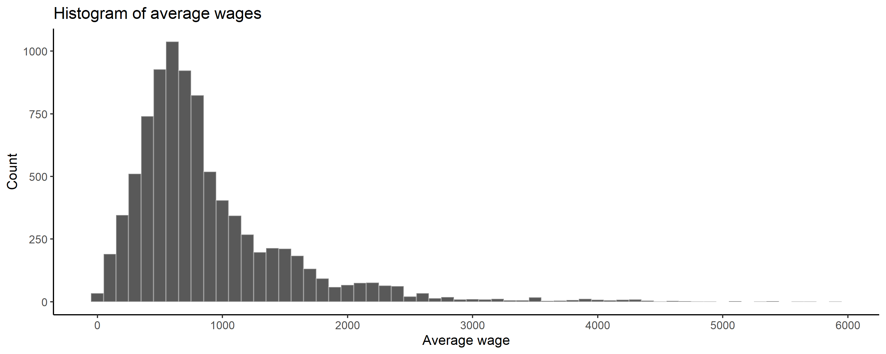
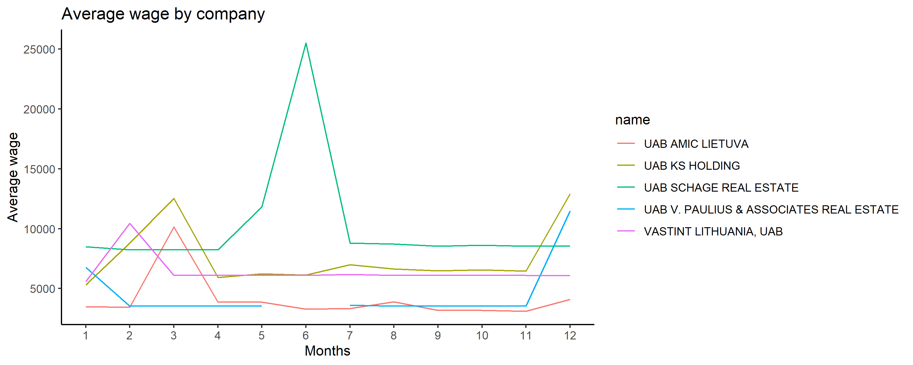
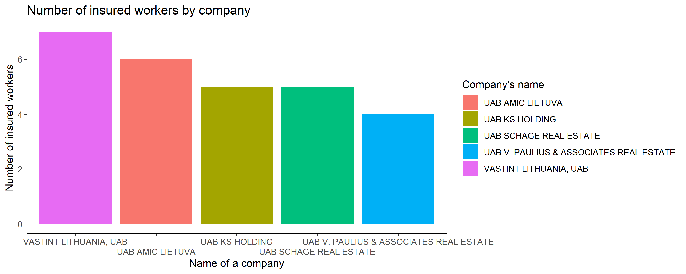

# R Laboratorinis darbas: duomenų vizualizacija

| Variantas    | ecoActCode    |
|------------- | ------------- |
|2             |682000         |

### 1. Užduotis

Atsakymas:

Išvados: Iš grafiko matome, kad atlyginimai yra pasiskirstę pagal normalųjį skirstinį. Vidutinis atlyginimas yra 921,53 eurai, standartinis nuokrypis yra 861,39 eurai, o mediana - 715.59 eurai.

### 2. Užduotis

Atsakymas:

Išvados: Iš grafiko matome, kad keturios iš penkių kompanijų (be UAB SCHAGE REAL ESTATE) turėjo atlyginimų padidėjimus metų pradžioje, 
taip pat trys iš penkių kompanijų (UAB KS HOLDING, UAB V. PAULIUS & ASSOCIATES REAL ESTATE bei UAB AMIC LIETUVA) turėjo atlyginimų padidėjimus metų gale. Vienintelė kompanija (UAB SCHAGE REAL ESTATE), kuri neturėjo atlyginimų padidėjimo nei metų pradžioje, nei metų gale, 
turėjo ryškų atlyginimo išaugimą metų viduryje: fiksuotas nežymus pakilimas gegužės mėnesį ir stiprus pakilimas birželio mėnesį, pakėlęs vidutinį atlyginimą nuo prieš tai
buvusių maždaug 9000 eurų iki kiek daugiau nei 25000 eurų.

### 3. Užduotis

Atsakymas:

Išvados: Iš grafiko matome, kad VASTINT LITHUANIA, UAB turi daugiausiai apdraustų darbuotojų (7), o mažiausiai jų turi UAB V. PAULIUS & ASSOCIATES REAL ESTATE (4). 
Bendrai pažvelgus darbuotojų skaičius šiose 5 kompanijose kompanijose ryškiai nesiskiria ir yra apylygis.

### 4. Užduotis

Shiny R aplikacijos nuotrauka:

